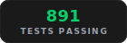

<p align="center">
  
</p>

<p align="center">
  <strong>Your coding agent remembers everything. No more re-explaining.</strong><br/>
  Persistent memory for Claude Code, Cursor, Gemini CLI, OpenCode, and any MCP client.
</p>

<p align="center">
  <a href="https://gist.github.com/rohitg00/2067ab416f7bbe447c1977edaaa681e2"></a>
</p>

<p align="center">
  <strong>The gist extends Karpathy's LLM Wiki pattern with confidence scoring, lifecycle, knowledge graphs, and hybrid search.<br/> agentmemory is the implementation.</strong>
</p>

<p align="center">
  <a href="https://www.npmjs.com/package/@agentmemory/agentmemory"></a>
  <a href="https://github.com/rohitg00/agentmemory/actions"></a>
  <a href="https://github.com/rohitg00/agentmemory/blob/main/LICENSE"></a>
  <a href="https://github.com/rohitg00/agentmemory/stargazers"></a>
</p>

<p align="center">
  <picture><source media="(prefers-color-scheme: dark)" srcset="assets/tags/light/stat-recall.svg"></picture>
  <picture><source media="(prefers-color-scheme: dark)" srcset="assets/tags/light/stat-tokens.svg"></picture>
  <picture><source media="(prefers-color-scheme: dark)" srcset="assets/tags/light/stat-tools.svg"></picture>
  <picture><source media="(prefers-color-scheme: dark)" srcset="assets/tags/light/stat-hooks.svg"></picture>
  <picture><source media="(prefers-color-scheme: dark)" srcset="assets/tags/light/stat-deps.svg"></picture>
  <picture><source media="(prefers-color-scheme: dark)" srcset="assets/tags/light/stat-tests.svg"></picture>
</p>

<p align="center">
  
</p>

<p align="center">
  <a href="#quick-start">Quick Start</a> &bull;
  <a href="#benchmarks">Benchmarks</a> &bull;
  <a href="#vs-competitors">vs Competitors</a> &bull;
  <a href="#works-with-every-agent">Agents</a> &bull;
  <a href="#how-it-works">How It Works</a> &bull;
  <a href="#mcp-server">MCP</a> &bull;
  <a href="#real-time-viewer">Viewer</a> &bull;
  <a href="#configuration">Config</a> &bull;
  <a href="#api">API</a> &bull;
  <a href="#operations">Operations</a>
</p>

---

<h2 id="works-with-every-agent"><picture><source media="(prefers-color-scheme: dark)" srcset="assets/tags/light/section-agents.svg"></picture></h2>

agentmemory works with any agent that supports hooks, MCP, or REST API. All agents share the same memory server.

<table>
<tr>
<td align="center" width="12.5%">
<a href="https://claude.com/product/claude-code"></a><br/>
<strong>Claude Code</strong><br/>
<sub>12 hooks + MCP + skills</sub>
</td>
<td align="center" width="12.5%">
<a href="integrations/openclaw/"></a><br/>
<strong>OpenClaw</strong><br/>
<sub>MCP + <a href="integrations/openclaw/">plugin</a></sub>
</td>
<td align="center" width="12.5%">
<a href="integrations/hermes/"></a><br/>
<strong>Hermes</strong><br/>
<sub>MCP + <a href="integrations/hermes/">plugin</a></sub>
</td>
<td align="center" width="12.5%">
<a href="https://cursor.com"></a><br/>
<strong>Cursor</strong><br/>
<sub>MCP server</sub>
</td>
<td align="center" width="12.5%">
<a href="https://github.com/google-gemini/gemini-cli"></a><br/>
<strong>Gemini CLI</strong><br/>
<sub>MCP server</sub>
</td>
<td align="center" width="12.5%">
<a href="https://github.com/opencode-ai/opencode"></a><br/>
<strong>OpenCode</strong><br/>
<sub>MCP server</sub>
</td>
<td align="center" width="12.5%">
<a href="https://github.com/openai/codex"></a><br/>
<strong>Codex CLI</strong><br/>
<sub>MCP server</sub>
</td>
<td align="center" width="12.5%">
<a href="https://github.com/cline/cline"></a><br/>
<strong>Cline</strong><br/>
<sub>MCP server</sub>
</td>
</tr>
<tr>
<td align="center" width="12.5%">
<a href="https://github.com/block/goose"></a><br/>
<strong>Goose</strong><br/>
<sub>MCP server</sub>
</td>
<td align="center" width="12.5%">
<a href="https://github.com/Kilo-Org/kilocode"></a><br/>
<strong>Kilo Code</strong><br/>
<sub>MCP server</sub>
</td>
<td align="center" width="12.5%">
<a href="https://github.com/Aider-AI/aider"></a><br/>
<strong>Aider</strong><br/>
<sub>REST API</sub>
</td>
<td align="center" width="12.5%">
<a href="https://claude.ai/download"></a><br/>
<strong>Claude Desktop</strong><br/>
<sub>MCP server</sub>
</td>
<td align="center" width="12.5%">
<a href="https://windsurf.com"></a><br/>
<strong>Windsurf</strong><br/>
<sub>MCP server</sub>
</td>
<td align="center" width="12.5%">
<a href="https://github.com/RooCodeInc/Roo-Code"></a><br/>
<strong>Roo Code</strong><br/>
<sub>MCP server</sub>
</td>
<td align="center" width="12.5%">
<a href="https://github.com/anthropics/claude-agent-sdk-typescript"></a><br/>
<strong>Claude SDK</strong><br/>
<sub>AgentSDKProvider</sub>
</td>
<td align="center" width="12.5%">
<br/>
<strong>Any agent</strong><br/>
<sub>REST API</sub>
</td>
</tr>
</table>

<p align="center">
  <sub>Works with <strong>any</strong> agent that speaks MCP or HTTP. One server, memories shared across all of them.</sub>
</p>

The included `docker-compose.yml` starts both `iii-engine` and the `agentmemory-worker`, mounts `iii-config.yaml` into the engine container, and persists iii state in the named `iii-data` volume.

---

You explain the same architecture every session. You re-discover the same bugs. You re-teach the same preferences. Built-in memory (CLAUDE.md, .cursorrules) caps out at 200 lines and goes stale. agentmemory fixes this. It silently captures what your agent does, compresses it into searchable memory, and injects the right context when the next session starts. One command. Works across agents.

**What changes:** Session 1 you set up JWT auth. Session 2 you ask for rate limiting. The agent already knows your auth uses jose middleware in `src/middleware/auth.ts`, your tests cover token validation, and you chose jose over jsonwebtoken for Edge compatibility. No re-explaining. No copy-pasting. The agent just *knows*.

```bash
npx @agentmemory/agentmemory
```

> **New in v0.8.2** — Security hardening (default localhost, viewer CSP nonces, mesh auth), `agentmemory demo` command, benchmark comparison vs mem0/Letta/Khoj, OpenClaw gateway plugin, real-time token savings in CLI + viewer.

---

<h2 id="benchmarks"><picture><source media="(prefers-color-scheme: dark)" srcset="assets/tags/light/section-benchmarks.svg"></picture></h2>

<table>
<tr>
<td width="50%">

### Retrieval Accuracy

**LongMemEval-S** (ICLR 2025, 500 questions)

| System | R@5 | R@10 | MRR |
|---|---|---|---|
| **agentmemory** | **95.2%** | **98.6%** | **88.2%** |
| BM25-only fallback | 86.2% | 94.6% | 71.5% |

</td>
<td width="50%">

### Token Savings

| Approach | Tokens/yr | Cost/yr |
|---|---|---|
| Paste full context | 19.5M+ | Impossible (exceeds window) |
| LLM-summarized | ~650K | ~$500 |
| **agentmemory** | **~170K** | **~$10** |
| agentmemory + local embeddings | ~170K | **$0** |

</td>
</tr>
</table>

> Embedding model: `all-MiniLM-L6-v2` (local, free, no API key). Full reports: [`benchmark/LONGMEMEVAL.md`](benchmark/LONGMEMEVAL.md), [`benchmark/QUALITY.md`](benchmark/QUALITY.md), [`benchmark/SCALE.md`](benchmark/SCALE.md). Competitor comparison: [`benchmark/COMPARISON.md`](benchmark/COMPARISON.md) — agentmemory vs mem0, Letta, Khoj, claude-mem, Hippo.

---

<h2 id="vs-competitors"><picture><source media="(prefers-color-scheme: dark)" srcset="assets/tags/light/section-competitors.svg"></picture></h2>

<table>
<tr>
<th width="20%"></th>
<th width="20%">agentmemory</th>
<th width="20%">mem0 (53K ⭐)</th>
<th width="20%">Letta / MemGPT (22K ⭐)</th>
<th width="20%">Built-in (CLAUDE.md)</th>
</tr>
<tr>
<td><strong>Type</strong></td>
<td>Memory engine + MCP server</td>
<td>Memory layer API</td>
<td>Full agent runtime</td>
<td>Static file</td>
</tr>
<tr>
<td><strong>Retrieval R@5</strong></td>
<td><strong>95.2%</strong></td>
<td>68.5% (LoCoMo)</td>
<td>83.2% (LoCoMo)</td>
<td>N/A (grep)</td>
</tr>
<tr>
<td><strong>Auto-capture</strong></td>
<td>12 hooks (zero manual effort)</td>
<td>Manual <code>add()</code> calls</td>
<td>Agent self-edits</td>
<td>Manual editing</td>
</tr>
<tr>
<td><strong>Search</strong></td>
<td>BM25 + Vector + Graph (RRF fusion)</td>
<td>Vector + Graph</td>
<td>Vector (archival)</td>
<td>Loads everything into context</td>
</tr>
<tr>
<td><strong>Multi-agent</strong></td>
<td>MCP + REST + leases + signals</td>
<td>API (no coordination)</td>
<td>Within Letta runtime only</td>
<td>Per-agent files</td>
</tr>
<tr>
<td><strong>Framework lock-in</strong></td>
<td>None (any MCP client)</td>
<td>None</td>
<td>High (must use Letta)</td>
<td>Per-agent format</td>
</tr>
<tr>
<td><strong>External deps</strong></td>
<td>None (SQLite + iii-engine)</td>
<td>Qdrant / pgvector</td>
<td>Postgres + vector DB</td>
<td>None</td>
</tr>
<tr>
<td><strong>Memory lifecycle</strong></td>
<td>4-tier consolidation + decay + auto-forget</td>
<td>Passive extraction</td>
<td>Agent-managed</td>
<td>Manual pruning</td>
</tr>
<tr>
<td><strong>Token efficiency</strong></td>
<td>~1,900 tokens/session ($10/yr)</td>
<td>Varies by integration</td>
<td>Core memory in context</td>
<td>22K+ tokens at 240 obs</td>
</tr>
<tr>
<td><strong>Real-time viewer</strong></td>
<td>Yes (port 3113)</td>
<td>Cloud dashboard</td>
<td>Cloud dashboard</td>
<td>No</td>
</tr>
<tr>
<td><strong>Self-hosted</strong></td>
<td>Yes (default)</td>
<td>Optional</td>
<td>Optional</td>
<td>Yes</td>
</tr>
</table>

---

<h2 id="quick-start"><picture><source media="(prefers-color-scheme: dark)" srcset="assets/tags/light/section-quickstart.svg"></picture></h2>

Compatibility: this release targets stable `iii-sdk` `^0.11.0` and iii-engine v0.11.x.

### Try it in 30 seconds

```bash
# Terminal 1: start the server
npx @agentmemory/agentmemory

# Terminal 2: seed sample data and see recall in action
npx @agentmemory/agentmemory demo
```

`demo` seeds 3 realistic sessions (JWT auth, N+1 query fix, rate limiting) and runs semantic searches against them. You'll see it find "N+1 query fix" when you search "database performance optimization" — keyword matching can't do that.

Open `http://localhost:3113` to watch the memory build live.

### Upgrade / Maintenance

Use the maintenance command when you intentionally want to update your local runtime:

```bash
npx @agentmemory/agentmemory upgrade
```

Warning: this command mutates the current workspace/runtime. It can update JavaScript dependencies, may run `cargo install iii-engine --force`, and may pull the configured iii Docker image.

Implementation details live in `src/cli.ts` (see `runUpgrade` around the `src/cli.ts:544-595` region).

### Claude Code (one block, paste it)

```
Install agentmemory: run `npx @agentmemory/agentmemory` in a separate terminal to start the memory server. Then run `/plugin marketplace add rohitg00/agentmemory` and `/plugin install agentmemory` — the plugin registers all 12 hooks, 4 skills, AND auto-wires the `@agentmemory/mcp` stdio server via its `.mcp.json`, so you get 44 MCP tools (memory_smart_search, memory_save, memory_sessions, memory_governance_delete, etc.) without any extra config step. Verify with `curl http://localhost:3111/agentmemory/health`. The real-time viewer is at http://localhost:3113.
```

<details>
<summary><b>OpenClaw (paste this prompt)</b></summary>

```
Install agentmemory for OpenClaw. Run `npx @agentmemory/agentmemory` in a separate terminal to start the memory server on localhost:3111. Then add this to my OpenClaw MCP config so agentmemory is available with all 44 memory tools:

{
  "mcpServers": {
    "agentmemory": {
      "command": "npx",
      "args": ["-y", "@agentmemory/mcp"]
    }
  }
}

Restart OpenClaw. Verify with `curl http://localhost:3111/agentmemory/health`. Open http://localhost:3113 for the real-time viewer. For deeper 4-hook gateway integration with startup injection, query-aware refresh, tool capture, and session-end maintenance, see integrations/openclaw in the agentmemory repo.
```

Full guide: [`integrations/openclaw/`](integrations/openclaw/)

</details>

<details>
<summary><b>Hermes Agent (paste this prompt)</b></summary>

```
Install agentmemory for Hermes. Run `npx @agentmemory/agentmemory` in a separate terminal to start the memory server on localhost:3111. Then add this to ~/.hermes/config.yaml so Hermes can use agentmemory as an MCP server with all 43 memory tools:

mcp_servers:
  agentmemory:
    command: npx
    args: ["-y", "@agentmemory/mcp"]

Verify with `curl http://localhost:3111/agentmemory/health`. Open http://localhost:3113 for the real-time viewer. For deeper 6-hook memory provider integration (pre-LLM context injection, turn capture, MEMORY.md mirroring, system prompt block), copy integrations/hermes from the agentmemory repo to ~/.hermes/plugins/memory/agentmemory.
```

Full guide: [`integrations/hermes/`](integrations/hermes/)

</details>

### Other agents

Start the memory server: `npx @agentmemory/agentmemory`

Then add the MCP config for your agent:

| Agent | Setup |
|---|---|
| **Cursor** | Add to `~/.cursor/mcp.json`: `{"mcpServers": {"agentmemory": {"command": "npx", "args": ["-y", "@agentmemory/mcp"]}}}` |
| **OpenClaw** | Add to MCP config: `{"mcpServers": {"agentmemory": {"command": "npx", "args": ["-y", "@agentmemory/mcp"]}}}` or use the [gateway plugin](integrations/openclaw/) |
| **Gemini CLI** | `gemini mcp add agentmemory -- npx -y @agentmemory/mcp` |
| **Codex CLI** | Add to `.codex/config.yaml`: `mcp_servers: {agentmemory: {command: npx, args: ["-y", "@agentmemory/mcp"]}}` |
| **OpenCode** | Add to `opencode.json`: `{"mcp": {"agentmemory": {"type": "local", "command": ["npx", "-y", "@agentmemory/mcp"], "enabled": true}}}` |
| **Hermes Agent** | Add to `~/.hermes/config.yaml` or use the [memory provider plugin](integrations/hermes/) |
| **Cline / Goose / Kilo Code** | Add MCP server in settings |
| **Claude Desktop** | Add to `claude_desktop_config.json`: `{"mcpServers": {"agentmemory": {"command": "npx", "args": ["-y", "@agentmemory/mcp"]}}}` |
| **Aider** | REST API: `curl -X POST http://localhost:3111/agentmemory/smart-search -d '{"query": "auth", "cwd": "/path/to/repo"}'` |
| **Any agent (32+)** | `npx skillkit install agentmemory` |

#### Codex integration levels

- `Generic Codex CLI`: MCP only via `.codex/config.yaml`
- `Codex-native adapter or fork`: optional deeper path that uses the always-on
  REST lifecycle lane for `session/start`, `observe`, `context/refresh` or
  `context`, `handoffs`, `summarize`, `session/end`, `crystals/auto`, and
  `consolidate-pipeline`
- `Explicit memory commands`: broader human-invoked surface for `remember`,
  `lessons`, `actions`, `frontier`, `next`, `missions`, `guardrails`,
  `decisions`, `dossiers`, `handoffs`, and related review/planning flows
- Surface contract: [`docs/codex_surface_contract_spec.md`](docs/codex_surface_contract_spec.md)

### From source

```bash
git clone https://github.com/rohitg00/agentmemory.git && cd agentmemory
npm install && npm run build && npm start
```

This starts agentmemory with a local `iii-engine` if `iii` is already installed, or falls back to Docker Compose if Docker is available. REST, streams, and the viewer bind to `127.0.0.1` by default.

Install `iii-engine` manually:

- **macOS / Linux:** `curl -fsSL https://install.iii.dev/iii/main/install.sh | sh`
- **Windows:** download `iii-x86_64-pc-windows-msvc.zip` from [iii-hq/iii releases](https://github.com/iii-hq/iii/releases/latest), extract `iii.exe`, add to PATH

Or use Docker (the bundled `docker-compose.yml` defaults to `iiidev/iii:0.11.3`; override with `AGENTMEMORY_III_DOCKER_IMAGE` if needed). Full docs: [iii.dev/docs](https://iii.dev/docs).

### Windows

agentmemory runs on Windows 10/11, but the Node.js package alone isn't enough — you also need the `iii-engine` runtime (a separate native binary) as a background process. The official upstream installer is a `sh` script and there is no PowerShell installer or scoop/winget package today, so Windows users have two paths:

**Option A — Prebuilt Windows binary (recommended):**

```powershell
# 1. Open https://github.com/iii-hq/iii/releases/latest in your browser
# 2. Download iii-x86_64-pc-windows-msvc.zip
#    (or iii-aarch64-pc-windows-msvc.zip if you're on an ARM machine)
# 3. Extract iii.exe somewhere on PATH, or place it at:
#    %USERPROFILE%\.local\bin\iii.exe
#    (agentmemory checks that location automatically)
# 4. Verify:
iii --version

# 5. Then run agentmemory as usual:
npx -y @agentmemory/agentmemory
```

**Option B — Docker Desktop:**

```powershell
# 1. Install Docker Desktop for Windows
# 2. Start Docker Desktop and make sure the engine is running
# 3. Run agentmemory — it will auto-start the bundled compose file:
npx -y @agentmemory/agentmemory
```

**Option C — standalone MCP only (no engine):** if you only need the MCP tools for your agent and don't need the REST API, viewer, or cron jobs, skip the engine entirely:

```powershell
npx -y @agentmemory/agentmemory mcp
# or via the shim package:
npx -y @agentmemory/mcp
```

**Diagnostics for Windows:** if `npx @agentmemory/agentmemory` fails, re-run with `--verbose` to see the actual engine stderr. Common failure modes:

| Symptom | Fix |
|---|---|
| `iii-engine process started` then `did not become ready within 15s` | Engine crashed on startup — re-run with `--verbose`, check stderr |
| `Could not start iii-engine` | Neither `iii.exe` nor Docker is installed. See Option A or B above |
| Port conflict | `netstat -ano \| findstr :3111` to see what's bound, then kill it or use `--port <N>` |
| Docker fallback skipped even though Docker is installed | Make sure Docker Desktop is actually running (system tray icon) |

> Note: there is no `cargo install iii-engine` — `iii` is not published to crates.io. The only supported install methods are the prebuilt binary above, the upstream `sh` install script (macOS/Linux only), and the Docker image.

---

<h2 id="why-agentmemory"><picture><source media="(prefers-color-scheme: dark)" srcset="assets/tags/light/section-why.svg"></picture></h2>

Every coding agent forgets everything when the session ends. You waste the first 5 minutes of every session re-explaining your stack. agentmemory runs in the background and eliminates that entirely.

```
Session 1: "Add auth to the API"
  Agent writes code, runs tests, fixes bugs
  agentmemory silently captures every tool use
  Session ends -> observations compressed into structured memory

Session 2: "Now add rate limiting"
  Agent already knows:
    - Auth uses JWT middleware in src/middleware/auth.ts
    - Tests in test/auth.test.ts cover token validation
    - You chose jose over jsonwebtoken for Edge compatibility
  Zero re-explaining. Starts working immediately.
```

### vs built-in agent memory

Every AI coding agent ships with built-in memory — Claude Code has `MEMORY.md`, Cursor has notepads, Cline has memory bank. These work like sticky notes. agentmemory is the searchable database behind the sticky notes.

| | Built-in (CLAUDE.md) | agentmemory |
|---|---|---|
| Scale | 200-line cap | Unlimited |
| Search | Loads everything into context | BM25 + vector + graph (top-K only) |
| Token cost | 22K+ at 240 observations | ~1,900 tokens (92% less) |
| Cross-agent | Per-agent files | MCP + REST (any agent) |
| Coordination | None | Leases, signals, actions, routines |
| Observability | Read files manually | Real-time viewer on :3113 |

---

<h2 id="how-it-works"><picture><source media="(prefers-color-scheme: dark)" srcset="assets/tags/light/section-how.svg"></picture></h2>

### Memory Pipeline

```
PostToolUse hook fires
  -> SHA-256 dedup (5min window)
  -> Privacy filter (strip secrets, API keys)
  -> Store raw observation
  -> LLM compress -> structured facts + concepts + narrative
  -> Vector embedding (6 providers + local)
  -> Index in BM25 + vector + knowledge graph

SessionStart hook fires
  -> Load project profile (top concepts, files, patterns)
  -> Hybrid search (BM25 + vector + graph)
  -> Token budget (default: 2000 tokens)
  -> Inject into conversation
```

### 4-Tier Memory Consolidation

Inspired by how human brains process memory — not unlike sleep consolidation.

| Tier | What | Analogy |
|------|------|---------|
| **Working** | Raw observations from tool use | Short-term memory |
| **Episodic** | Compressed session summaries | "What happened" |
| **Semantic** | Extracted facts and patterns | "What I know" |
| **Procedural** | Workflows and decision patterns | "How to do it" |

Memories decay over time (Ebbinghaus curve). Frequently accessed memories strengthen. Stale memories auto-evict. Contradictions are detected and resolved.

### What Gets Captured

| Hook | Captures |
|------|----------|
| `SessionStart` | Project path, session ID |
| `UserPromptSubmit` | User prompts (privacy-filtered) |
| `PreToolUse` | File access patterns + enriched context |
| `PostToolUse` | Tool name, input, output |
| `PostToolUseFailure` | Error context |
| `PreCompact` | Re-injects memory before compaction |
| `SubagentStart/Stop` | Sub-agent lifecycle |
| `Stop` | End-of-session summary |
| `SessionEnd` | Session complete marker |

### Key Capabilities

| Capability | Description |
|---|---|
| **Automatic capture** | Every tool use recorded via hooks — zero manual effort |
| **Semantic search** | BM25 + vector + knowledge graph with RRF fusion |
| **Memory evolution** | Versioning, supersession, relationship graphs |
| **Auto-forgetting** | TTL expiry, contradiction detection, importance eviction |
| **Privacy first** | API keys, secrets, `<private>` tags stripped before storage |
| **Self-healing** | Circuit breaker, provider fallback chain, health monitoring |
| **Claude bridge** | Bi-directional sync with MEMORY.md |
| **Knowledge graph** | Entity extraction + BFS traversal |
| **Team memory** | Namespaced shared + private across team members |
| **Citation provenance** | Trace any memory back to source observations |
| **Git snapshots** | Version, rollback, and diff memory state |

---

<h2 id="search"><picture><source media="(prefers-color-scheme: dark)" srcset="assets/tags/light/section-search.svg"></picture></h2>

Triple-stream retrieval combining three signals:

| Stream | What it does | When |
|---|---|---|
| **BM25** | Stemmed keyword matching with synonym expansion | Always on |
| **Vector** | Cosine similarity over dense embeddings | Embedding provider configured |
| **Graph** | Knowledge graph traversal via entity matching | Entities detected in query |

Fused with Reciprocal Rank Fusion (RRF, k=60) and session-diversified (max 3 results per session).

### Embedding providers

agentmemory auto-detects your provider. For best results, install local embeddings (free) when you want the optional local provider:

```bash
npm install @xenova/transformers
```

| Provider | Model | Dimensions | Env Var | Notes |
|---|---|---|---|---|
| **Local (recommended)** | `all-MiniLM-L6-v2` | 384 | `EMBEDDING_PROVIDER=local` | Free, offline, +8pp recall over BM25-only |
| Gemini | `gemini-embedding-2-preview` | 3072 full / configurable lower | `GEMINI_API_KEY` | Set `GEMINI_EMBEDDING_MODEL` or `GEMINI_EMBEDDING_DIMENSIONS` to override |
| OpenAI | `text-embedding-3-small` | 1536 | `OPENAI_API_KEY` | $0.02/1M tokens |
| Voyage AI | `voyage-code-3` | 1024 | `VOYAGE_API_KEY` | Optimized for code |
| Cohere | `embed-english-v3.0` | 1024 | `COHERE_API_KEY` | Free trial available |
| OpenRouter | Any embedding model | varies | `OPENROUTER_API_KEY` | Multi-model proxy |

---

<h2 id="mcp-server"><picture><source media="(prefers-color-scheme: dark)" srcset="assets/tags/light/section-mcp.svg"></picture></h2>

44 tools, 6 resources, 3 prompts, and 4 skills — the most comprehensive MCP memory toolkit for any agent.

### 44 Tools

<details>
<summary>Core tools (always available)</summary>

| Tool | Description |
|------|-------------|
| `memory_recall` | Search past observations |
| `memory_compress_file` | Compress markdown files while preserving structure |
| `memory_save` | Save an insight, decision, or pattern |
| `memory_patterns` | Detect recurring patterns |
| `memory_smart_search` | Hybrid semantic + keyword search |
| `memory_file_history` | Past observations about specific files |
| `memory_sessions` | List recent sessions |
| `memory_timeline` | Chronological observations |
| `memory_profile` | Project profile (concepts, files, patterns) |
| `memory_export` | Export all memory data |
| `memory_relations` | Query relationship graph |

</details>

<details>
<summary>Extended tools (44 total — set AGENTMEMORY_TOOLS=all)</summary>

| Tool | Description |
|------|-------------|
| `memory_patterns` | Detect recurring patterns |
| `memory_timeline` | Chronological observations |
| `memory_relations` | Query relationship graph |
| `memory_graph_query` | Knowledge graph traversal |
| `memory_consolidate` | Run 4-tier consolidation |
| `memory_claude_bridge_sync` | Sync with MEMORY.md |
| `memory_team_share` | Share with team members |
| `memory_team_feed` | Recent shared items |
| `memory_audit` | Audit trail of operations |
| `memory_governance_delete` | Delete with audit trail |
| `memory_snapshot_create` | Git-versioned snapshot |
| `memory_action_create` | Create work items with dependencies |
| `memory_action_update` | Update action status |
| `memory_frontier` | Unblocked actions ranked by priority |
| `memory_next` | Single most important next action |
| `memory_lease` | Exclusive action leases (multi-agent) |
| `memory_routine_run` | Instantiate workflow routines |
| `memory_signal_send` | Inter-agent messaging |
| `memory_signal_read` | Read messages with receipts |
| `memory_checkpoint` | External condition gates |
| `memory_mesh_sync` | P2P sync between instances |
| `memory_sentinel_create` | Event-driven watchers |
| `memory_sentinel_trigger` | Fire sentinels externally |
| `memory_sketch_create` | Ephemeral action graphs |
| `memory_sketch_promote` | Promote to permanent |
| `memory_crystallize` | Compact action chains |
| `memory_diagnose` | Health checks |
| `memory_heal` | Auto-fix stuck state |
| `memory_facet_tag` | Dimension:value tags |
| `memory_facet_query` | Query by facet tags |
| `memory_verify` | Trace provenance |

</details>

### 6 Resources · 3 Prompts · 4 Skills

| Type | Name | Description |
|------|------|-------------|
| Resource | `agentmemory://status` | Health, session count, memory count |
| Resource | `agentmemory://project/{name}/profile` | Per-project intelligence |
| Resource | `agentmemory://memories/latest` | Latest 10 active memories |
| Resource | `agentmemory://graph/stats` | Knowledge graph statistics |
| Prompt | `recall_context` | Search + return context messages |
| Prompt | `session_handoff` | Handoff data between agents |
| Prompt | `detect_patterns` | Analyze recurring patterns |
| Skill | `/recall` | Search memory |
| Skill | `/remember` | Save to long-term memory |
| Skill | `/session-history` | Recent session summaries |
| Skill | `/forget` | Delete observations/sessions |

### Standalone MCP

Run without the full server — for any MCP client. Either of these works:

```bash
npx -y @agentmemory/agentmemory mcp   # canonical (always available)
npx -y @agentmemory/mcp                # shim package alias
```

Or add to your agent's MCP config:

Most agents (Cursor, Claude Desktop, Cline, etc.):
```json
{
  "mcpServers": {
    "agentmemory": {
      "command": "npx",
      "args": ["-y", "@agentmemory/mcp"]
    }
  }
}
```

OpenCode (`opencode.json`):
```json
{
  "mcp": {
    "agentmemory": {
      "type": "local",
      "command": ["npx", "-y", "@agentmemory/mcp"],
      "enabled": true
    }
  }
}
```

---

<h2 id="real-time-viewer"><picture><source media="(prefers-color-scheme: dark)" srcset="assets/tags/light/section-viewer.svg"></picture></h2>

Auto-starts on port `3113`. Live observation stream, session explorer, memory browser, knowledge graph visualization, and health dashboard.

```bash
open http://localhost:3113
```

The viewer server binds to `127.0.0.1` by default. The REST-served `/agentmemory/viewer` endpoint follows the normal `AGENTMEMORY_SECRET` bearer-token rules. CSP headers use a per-response script nonce and disable inline handler attributes (`script-src-attr 'none'`).

---

<h2 id="configuration"><picture><source media="(prefers-color-scheme: dark)" srcset="assets/tags/light/section-config.svg"></picture></h2>

### LLM Providers

agentmemory auto-detects from your environment. No API key needed if you have a Claude subscription.

| Provider | Config | Notes |
|----------|--------|-------|
| **Claude subscription** (default) | No config needed | Uses `@anthropic-ai/claude-agent-sdk` |
| Anthropic API | `ANTHROPIC_API_KEY` | Per-token billing |
| MiniMax | `MINIMAX_API_KEY` | Anthropic-compatible |
| Gemini | `GEMINI_API_KEY` | Also enables embeddings |
| OpenRouter | `OPENROUTER_API_KEY` | Any model |

### Environment Variables

Create `.env.local` in the repo root:

```env
# LLM provider (pick one, or leave empty for Claude subscription)
# ANTHROPIC_API_KEY=sk-ant-...
# GEMINI_API_KEY=...
# GEMINI_MODEL=gemini-flash-latest
# GEMINI_EMBEDDING_MODEL=gemini-embedding-2-preview
# GEMINI_EMBEDDING_DIMENSIONS=3072
# OPENROUTER_API_KEY=...

# Embedding provider (auto-detected, or override)
# EMBEDDING_PROVIDER=local
# VOYAGE_API_KEY=...

# Search tuning
# BM25_WEIGHT=0.4
# VECTOR_WEIGHT=0.6
# TOKEN_BUDGET=2000

# Auth
# AGENTMEMORY_SECRET=your-secret

# Ports (defaults: 3111 API, 3113 viewer)
# III_REST_PORT=3111

# Features
# AGENTMEMORY_AUTO_COMPRESS=false  # OFF by default (#138). When on,
                                   # every PostToolUse hook calls your
                                   # LLM provider to compress the
                                   # observation — expect significant
                                   # token spend on active sessions.
# AGENTMEMORY_INJECT_CONTEXT=false # OFF by default (#143). When on:
                                   # - SessionStart may inject ~1-2K
                                   #   chars of project context into
                                   #   the first turn of each session
                                   #   (this is what actually reaches
                                   #   the model — Claude Code treats
                                   #   SessionStart stdout as context)
                                   # - PreToolUse fires /agentmemory/enrich
                                   #   on every file-touching tool call
                                   #   (resource cleanup, not a token
                                   #   fix — PreToolUse stdout is debug
                                   #   log only per Claude Code docs)
                                   # Observations are still captured via
                                   # PostToolUse regardless of this flag.
# GRAPH_EXTRACTION_ENABLED=true
# GRAPH_EXTRACTION_BATCH_SIZE=10
# CONSOLIDATION_ENABLED=true
# CONSOLIDATION_DECAY_DAYS=30
# LESSON_DECAY_ENABLED=true
# OBSIDIAN_AUTO_EXPORT=false
# AGENTMEMORY_EXPORT_ROOT=~/.agentmemory
# CLAUDE_MEMORY_BRIDGE=false
# SNAPSHOT_ENABLED=false

# Team
# TEAM_ID=
# USER_ID=
# TEAM_MODE=private

# Tool visibility: "core" (8 tools) or "all" (44 tools)
# AGENTMEMORY_TOOLS=core
```

---

<h2 id="api"><picture><source media="(prefers-color-scheme: dark)" srcset="assets/tags/light/section-api.svg"></picture></h2>

143 endpoints on port `3111`. The REST API binds to `127.0.0.1` by default. Protected endpoints require `Authorization: Bearer <secret>` when `AGENTMEMORY_SECRET` is set, and mesh sync endpoints require `AGENTMEMORY_SECRET` on both peers.

<details>
<summary>Key endpoints</summary>

| Method | Path | Description |
|--------|------|-------------|
| `GET` | `/agentmemory/health` | Health check (always public) |
| `POST` | `/agentmemory/session/start` | Start session + get context |
| `POST` | `/agentmemory/session/end` | End session |
| `POST` | `/agentmemory/session/closeout` | Bounded session closeout with step status |
| `POST` | `/agentmemory/observe` | Capture observation |
| `POST` | `/agentmemory/compress-retry` | Drain deferred observation compression work with bounded retry budgets |
| `POST` | `/agentmemory/smart-search` | Hybrid search |
| `POST` | `/agentmemory/retrieval-index/verify` | Verify retrieval index drift |
| `POST` | `/agentmemory/index-persistence/compact` | Physically compact persisted index shards under health gates; pass `dryRun: true` for StateKV RSS diagnostics without writes |
| `POST` | `/agentmemory/insights/decay-sweep` | Decay insights and prune old soft-deleted insights in bounded batches; pass `dryRun: true` to estimate prune candidates |
| `POST` | `/agentmemory/active-scopes/diagnostics` | Summarize turn-capsule and working-set scope size, age, project distribution, and stale candidates without mutation |
| `POST` | `/agentmemory/retrieval-vector/backfill` | Backfill missing retrieval vectors within bounded health-gated budgets |
| `POST` | `/agentmemory/retrieval-blocks/diagnostics` | Inspect retrieval block scope/index state without full scans |
| `POST` | `/agentmemory/retrieval-proof` | Gather a lightweight retrieval proof bundle without maintenance or retry side effects |
| `POST` | `/agentmemory/codex-integration/proof` | Prove Codex integration contract, context quality, and latency separately |
| `POST` | `/agentmemory/retrieval-blocks/retry` | Drain deferred retrieval-block indexing work with bounded retry budgets |
| `POST` | `/agentmemory/retrieval-blocks/migrate-shards` | Move legacy retrieval block payloads into deterministic StateKV shard scopes |
| `POST` | `/agentmemory/retrieval-quality/summary` | Store compact retrieval eval summary |
| `POST` | `/agentmemory/consolidated-memory/backfill` | Backfill legacy semantic/procedural project scope |
| `POST` | `/agentmemory/context` | Generate context |
| `POST` | `/agentmemory/missions` | Create a mission |
| `GET` | `/agentmemory/missions/:id` | Get mission state + projection |
| `POST` | `/agentmemory/handoffs/generate` | Generate a durable handoff packet |
| `GET` | `/agentmemory/handoffs` | List handoff packets |
| `GET` | `/agentmemory/handoffs/:id` | Get a handoff packet |
| `GET` | `/agentmemory/branch-overlays` | Review branch-scoped overlay notes |
| `GET` | `/agentmemory/guardrails` | Review negative-memory guardrails |
| `GET` | `/agentmemory/decisions` | Review durable decision records |
| `GET` | `/agentmemory/dossiers` | Review file-level component dossiers |
| `GET` | `/agentmemory/routine-candidates` | Review proposal-only routine candidates |
| `POST` | `/agentmemory/remember` | Save to long-term memory |
| `POST` | `/agentmemory/forget` | Delete observations |
| `POST` | `/agentmemory/enrich` | File context + memories + bugs |
| `POST` | `/agentmemory/context/refresh` | Query-aware freshness-first context |
| `GET` | `/agentmemory/profile` | Project profile |
| `GET` | `/agentmemory/export` | Export all data |
| `POST` | `/agentmemory/import` | Import from JSON |
| `POST` | `/agentmemory/graph/query` | Knowledge graph query |
| `POST` | `/agentmemory/team/share` | Share with team |
| `GET` | `/agentmemory/audit` | Audit trail |

Full endpoint list: [`src/triggers/api.ts`](src/triggers/api.ts)

Codex note: MCP-only setup is not the same as native lifecycle capture. For the
receiver-side split between the always-on runtime lane and the broader explicit
memory lane, see
[`docs/codex_surface_contract_spec.md`](docs/codex_surface_contract_spec.md).

</details>

---

<h2 id="architecture"><picture><source media="(prefers-color-scheme: dark)" srcset="assets/tags/light/section-architecture.svg"></picture></h2>

Built on [iii-engine](https://iii.dev)'s three primitives — no Express, no Postgres, no Redis.

**118 source files · ~21,800 LOC · 646 tests · 123 functions · 34 KV scopes**

<details>
<summary>What iii-engine replaces</summary>

| Traditional stack | agentmemory uses |
|---|---|
| Express.js / Fastify | iii HTTP Triggers |
| SQLite / Postgres + pgvector | iii KV State + in-memory vector index |
| SSE / Socket.io | iii Streams (WebSocket) |
| pm2 / systemd | iii-engine worker management |
| Prometheus / Grafana | iii OTEL + health monitor |

</details>

<h2 id="development"><picture><source media="(prefers-color-scheme: dark)" srcset="assets/tags/light/section-development.svg"></picture></h2>
| **Memory Evolution** | `evolve`, `auto-forget`, `evict` | Version memories, TTL expiry, importance-based eviction |
| | `consolidate`, `consolidate-pipeline` | Merge duplicates, 4-tier consolidation (working→episodic→semantic→procedural) |
| | `verify`, `cascade-update` | Citation chain provenance, staleness propagation |
| **Knowledge Graph** | `graph-extract`, `graph-query`, `graph-stats` | LLM entity extraction, BFS traversal, statistics |
| | `temporal-graph-extract`, `temporal-query` | Temporal knowledge extraction + point-in-time queries |
| **Relationships** | `relate`, `get-related`, `timeline`, `profile` | Memory relations, chronological view, project profiles |
| **Claude Bridge** | `claude-bridge-read`, `claude-bridge-sync` | Bi-directional sync with MEMORY.md |
| **Actions** | `action-create`, `action-update`, `action-get`, `action-list` | Dependency-aware work items with typed edges |
| | `action-edge-create` | Create typed edges between actions (requires, unlocks, gated_by) |
| | `frontier`, `next` | Priority-ranked unblocked action queue |
| **Leases** | `lease-acquire`, `lease-release`, `lease-renew`, `lease-cleanup` | TTL-based atomic agent claims with auto-cleanup |
| **Routines** | `routine-create`, `routine-freeze`, `routine-list`, `routine-run`, `routine-status` | Frozen workflow templates instantiated into action chains |
| **Signals** | `signal-send`, `signal-read`, `signal-threads`, `signal-cleanup` | Threaded inter-agent messaging with read receipts |
| **Checkpoints** | `checkpoint-create`, `checkpoint-resolve`, `checkpoint-list`, `checkpoint-expire` | External condition gates (CI, approval, deploy) |
| **Mesh** | `mesh-register`, `mesh-sync`, `mesh-receive`, `mesh-list`, `mesh-remove` | P2P sync between agentmemory instances |
| **Sentinels** | `sentinel-create`, `sentinel-trigger`, `sentinel-check`, `sentinel-cancel`, `sentinel-list`, `sentinel-expire` | Event-driven condition watchers |
| **Sketches** | `sketch-create`, `sketch-add`, `sketch-promote`, `sketch-discard`, `sketch-list`, `sketch-gc` | Ephemeral action graphs with auto-expiry |
| **Crystals** | `crystallize`, `auto-crystallize`, `crystal-list`, `crystal-get` | LLM-powered compaction of action chains into digests |
| **Lessons** | `lesson-save`, `lesson-recall`, `lesson-list`, `lesson-strengthen`, `lesson-decay-sweep` | Confidence-scored lessons with dedup, reinforcement, and decay |
| **Facets** | `facet-tag`, `facet-untag`, `facet-query`, `facet-get`, `facet-stats`, `facet-dimensions` | Multi-dimensional tagging with AND/OR queries |
| **Diagnostics** | `diagnose`, `heal` | Self-diagnosis across 8 categories with auto-fix |
| **Flow** | `flow-compress` | LLM summarization of completed action chains |
| **Branch** | `detect-worktree`, `list-worktrees`, `branch-sessions` | Git worktree detection for shared memory |
| **Team** | `team-share`, `team-feed`, `team-profile` | Namespaced shared + private team memory |
| **Governance** | `governance-delete`, `governance-bulk`, `audit-query` | Delete with audit trail, bulk operations |
| **Snapshots** | `snapshot-create`, `snapshot-list`, `snapshot-restore` | Git-versioned memory state |
| **Export** | `obsidian-export` | Obsidian-compatible Markdown with YAML frontmatter + wikilinks |

### Data Model (34 KV scopes)

| Scope | Stores |
|-------|--------|
| `mem:sessions` | Session metadata, project, timestamps |
| `mem:obs:{session_id}` | Compressed observations with embeddings |
| `mem:summaries` | End-of-session summaries |
| `mem:memories` | Long-term memories (versioned, with relationships) |
| `mem:relations` | Memory relationship graph |
| `mem:profiles` | Aggregated project profiles |
| `mem:emb:{obs_id}` | Vector embeddings |
| `mem:index:bm25` | Persisted BM25 index |
| `mem:metrics` | Per-function metrics |
| `mem:health` | Health snapshots |
| `mem:config` | Runtime configuration overrides |
| `mem:confidence` | Confidence scores for memories |
| `mem:claude-bridge` | Claude Code MEMORY.md bridge state |
| `mem:graph:nodes` | Knowledge graph entities |
| `mem:graph:edges` | Knowledge graph relationships |
| `mem:semantic` | Semantic memories (consolidated facts) |
| `mem:procedural` | Procedural memories (extracted workflows) |
| `mem:team:{id}:shared` | Team shared items |
| `mem:team:{id}:users:{uid}` | Per-user team state |
| `mem:team:{id}:profile` | Aggregated team profile |
| `mem:audit` | Audit trail for all operations |
| `mem:actions` | Dependency-aware work items |
| `mem:action-edges` | Typed edges (requires, unlocks, gated_by, etc.) |
| `mem:leases` | TTL-based agent work claims |
| `mem:routines` | Frozen workflow templates |
| `mem:routine-runs` | Instantiated routine execution tracking |
| `mem:signals` | Inter-agent messages with threading |
| `mem:checkpoints` | External condition gates |
| `mem:mesh` | Registered P2P sync peers |
| `mem:sentinels` | Event-driven condition watchers |
| `mem:sketches` | Ephemeral action graphs |
| `mem:crystals` | Compacted action chain digests |
| `mem:facets` | Multi-dimensional tags |
| `mem:lessons` | Confidence-scored lessons with decay |

## Operations

### Health checks

The worker exposes two health endpoints:

| Endpoint | What it checks | Auth |
|----------|---------------|------|
| `GET /agentmemory/livez` | Process liveness (served directly from the viewer HTTP server, no engine dependency) | Public |
| `GET /agentmemory/health` | Full runtime health — heap, CPU, event loop lag, connection state, function metrics | Requires `AGENTMEMORY_SECRET` when set |

Docker healthcheck uses `/agentmemory/livez` on port 3113. This endpoint never touches the iii-engine, so the container stays healthy even when the engine is temporarily unresponsive.

### Common failure: StateKV timeouts after long engine uptime

The iii-engine's internal websocket channels can go stale after 12–24+ hours of continuous operation. When this happens:

**Symptoms:**
- `docker ps` shows the worker as `unhealthy`
- Worker logs show `StateKV state::set timed out after 5000ms` or `StateKV temporarily unavailable`
- `/agentmemory/health` returns 503 or times out
- `/agentmemory/livez` should still return 200 (it bypasses the engine)

**Fix:**
```bash
docker compose restart
```

This restarts both the engine and worker, clearing stale channels. Data is preserved in the `iii-data` volume.

**Mitigation already in place:**
- Maintenance loops (consolidation, auto-forget, eviction, index verify) pause automatically when health is degraded via the maintenance gate
- KV calls use short timeouts with cooldown periods instead of blocking on long SDK waits
- Consolidation scans are bounded per run to avoid saturating the engine
- Healthcheck tolerances: 10s timeout, 5 retries, 30s start period

### Restarting and rebuilding

```bash
# Restart without rebuilding (clears stale engine state)
docker compose restart

# Rebuild the worker image explicitly
docker compose build agentmemory-worker

# Rebuild after code changes
docker compose up -d --build

# Rebuild only the worker (faster, keeps engine running)
docker compose up -d --build agentmemory-worker

# Force-recreate the worker from the current local image
docker compose up -d --force-recreate agentmemory-worker

# Common live-fix sequence after worker code changes
docker compose build agentmemory-worker
docker compose up -d --force-recreate agentmemory-worker

# View worker logs
docker compose logs -f agentmemory-worker

# Check container health
docker compose ps
```

### Launch Agent (macOS)

agentmemory is registered as a Launch Agent (`com.agentmemory`) that starts on login. The startup script is at `~/Projects/agentmemory/start.sh`. Logs go to `/tmp/agentmemory.log`.

```bash
# Check if running
launchctl list | grep agentmemory

# Restart via launchctl
launchctl kickstart -k gui/$(id -u)/com.agentmemory

# Or restart docker directly
cd ~/Projects/agentmemory && docker compose restart
```

### Key tuning variables

| Variable | Default | Effect |
|----------|---------|--------|
| `CONSOLIDATION_ENABLED` | `true` | Enable/disable the 4-tier consolidation pipeline |
| `AUTO_FORGET_ENABLED` | `true` | Enable/disable automatic memory eviction |
| `LESSON_DECAY_ENABLED` | `true` | Enable/disable lesson confidence decay |
| `TOKEN_BUDGET` | `8000` | Max tokens injected at session start |
| `MAX_OBS_PER_SESSION` | `500` | Cap on observations per session |

When diagnosing stability issues, disable `AUTO_FORGET_ENABLED` and `CONSOLIDATION_ENABLED` first to isolate whether maintenance loops are contributing to engine saturation.

## Development

```bash
npm run dev               # Hot reload
npm run build             # Production build
npm test                  # 646 tests (~1.7s)
npm run test:integration  # API tests (requires running services)
```

**Prerequisites:** Node.js >= 20, [iii-engine](https://iii.dev/docs) or Docker

<h2 id="license"><picture><source media="(prefers-color-scheme: dark)" srcset="assets/tags/light/section-license.svg"></picture></h2>

This repository is distributed under [Apache-2.0](LICENSE).

If you publish or redistribute this fork:

- keep the [LICENSE](LICENSE) file with the source or any redistributions
- keep the [NOTICE](NOTICE) file with the source or any redistributions from this fork
- retain upstream copyright and attribution notices that still apply
- clearly mark any files you modify when redistributing source form under Apache-2.0 section 4(b)

Original upstream project: [rohitg00/agentmemory](https://github.com/rohitg00/agentmemory)
